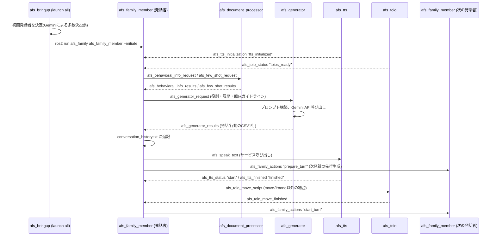
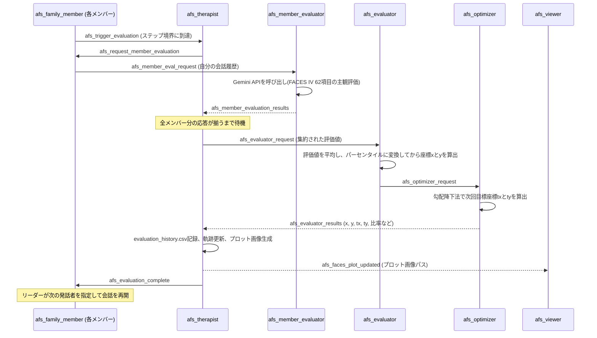
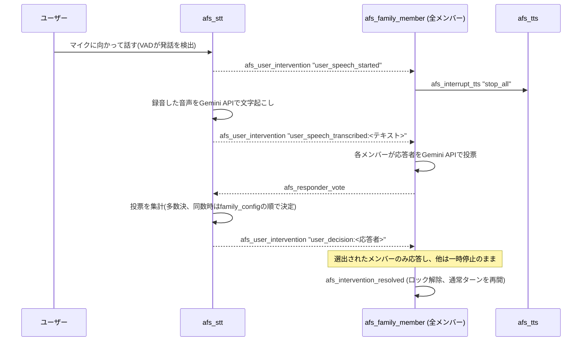

[**English**](README.md) | [**日本語**](README.ja.md)

# AFS: Agent Family System (エージェント家族システム)

AFS (Agent Family System) は、父親ロボット・母親ロボット・娘ロボットのようなロボット（エージェント）と人から構成される「新しい家族」を実現しようとするエージェント家族システムです。人がロボット家族とインタラクションを行うことで家族のような温かみや安全基地感を感じ、最終的には孤立・孤独感を軽減することを目指します。ROS2とLLMを用いて、家族のような会話や挙動を行うマルチエージェントシステムを実装しています。人はロボット家族の会話中にマイクに向かって話しかけることでいつでも介入することができます。ロボット家族の会話をより人間の家族のような会話にしていくために、AFSはOlsonの家族円環モデルおよびその評価尺度であるFACES IVに基づいてロボット家族の挙動を調整します。具体的には、Olsonの家族円環モデル上で現在のロボット家族がどの状態にあるかをプロットすることで可視化し、アンバランスタイプの場合は勾配降下法（Gradient Descent）を用いて理想的なバランスタイプの家族に近づくようにします。これらの調整は、ロボット家族メンバーとは別のセラピストノード（エージェント）が行います。

このプロジェクトは、筑波大学 **田中文英研究室** の研究の一部として開発されています。当研究室では、主にHRI（Human-Robot Interaction）に焦点を当て、いつもわたしたちのそばにいてわたしたちの人生を助けてくれる知的なエージェント技術を創出するような研究を行っています。

🔗 **研究室の詳細についてはこちら**: [田中文英研究室 - プロジェクト](https://www.ftl.iit.tsukuba.ac.jp/projects/)

## 🌟 主な機能

- **マルチエージェントインタラクション**: LLMにより家族メンバーそれぞれの個性（父親・母親・娘など）を表現します。また、ROS2により各エージェントの会話を同期させ、家族のような会話を実現します。
- **FACES IV 可視化**: ロボット家族の現在の状態と理想的な状態をOlsonの家族円環モデルの「Cohesion（凝集性）」と「Flexibility（適用性）」の軸上にリアルタイムでプロットします。
- **移動による物理的表現**: [toio™](https://toio.io/) ロボットとの連携もでき、ロボットが移動することで人との物理的な距離を変化させることができます。
- **インタラクティブ**: Gemini Liveを用いたリアルタイム音声認識（STT）と音声合成（TTS）により、人間がロボット家族の会話に介入することが可能です。

## 🏗 システムアーキテクチャと処理フロー

AFSは、**セラピストノード** (`afs_therapist`) がOlsonの家族円環モデルに基づいてロボット家族メンバーをバランスタイプへと導くクローズドループ・サイクルで動作します。**人（ユーザ）** はいつでもロボット家族の会話に介入し、影響を与えることができます。


### ノードごとの詳細な役割

| ノード | 役割 | 主な機能 |
| :--- | :--- | :--- |
| **`afs_family`** | ロボット家族ノード | LLMを用いてロボット家族の個性（父親・母親・娘など）をシミュレートします。 |
| **`afs_tts`** | Text-to-Speechノード | Gemini Liveを用いてロボット家族メンバーが喋るための音声合成を行います。 |
| **`afs_toio`** | Toioロボットノード| ロボット家族メンバーを各[toio™](https://toio.io/) ロボットに割り当てて、物理的な移動を可能にします。 |
| **`afs_therapist`** | セラピストノード | 勾配降下法を用いて、ロボット家族がバランスタイプに近づくように導きます。 |
| **`afs_viewer`** | 家族円環モデル可視化ノード | ロボット家族の状態（軌跡）を家族円環モデル上にプロットします。 |
| **`afs_evaluation`** | FACESⅣ評価ノード | ロボット家族の会話ログをもとにFACESⅣを評価します。 |
| **`afs_stt`** | Speech-to-Textノード | Gemini Liveを用いて人が介入するためのリアルタイム音声認識を行います。 |

### シーケンス図

以下は、主要な3つの流れ（起動〜1会話ターン、定期的なFACES IV評価サイクル、ユーザーによる音声介入）における、ノード間のROS2トピック/サービスのやり取りを示したものです。

#### 1. 起動〜1会話ターン



#### 2. 定期的なFACES IV評価サイクル

会話が `turns_per_step` ターン進むごとに、セラピストノードが会話を一時停止し、評価→勾配降下法→再プロットの一連のサイクルを取りまとめてから会話を再開させます。



#### 3. ユーザーによる音声介入



## 🚀 はじめに

### 🖥 ネイティブインストール（Ubuntu 24.04 のみ）（推奨）

Dockerを使わずにUbuntu上で直接AFSを実行する場合:

#### 前提条件
- **OS**: Ubuntu 24.04 (Noble Numbat)
- **ROS2**: [Jazzy Jalisco](https://docs.ros.org/en/jazzy/Installation.html) (詳細は [ROS2 インストール方法](docs/ros2_installation.ja.md) を参照)
- **Hardware**: [toio™](https://toio.io/) コア キューブ (オプション)、[Bluetooth スピーカー](https://www.amazon.co.jp/ELUT-%E3%83%8F%E3%83%B3%E3%82%BA%E3%83%95%E3%83%AA%E3%83%BC%E3%83%BB%E3%82%B9%E3%83%9E%E3%83%BC%E3%83%88%E3%82%A2%E3%82%B7%E3%82%B9%E3%83%88%E3%82%B9%E3%83%94%E3%83%BC%E3%82%AB%E3%83%BC-%E3%83%96%E3%83%A9%E3%83%83%E3%82%AF-EMBS-HFSASBK-%EF%BC%BBBluetooth%E5%AF%BE%E5%BF%9C%EF%BC%BD/dp/B08CDQCWV8) (オプション)。

#### 必要ライブラリ (Requirements)

**1. システム依存関係**
```bash
sudo apt update && sudo apt install -y python3-tk libportaudio2
```

**2. Python ライブラリ**
```bash
pip install openai google-genai numpy sounddevice webrtcvad matplotlib toio-py Pillow
```

#### インストール

1. **クローンとビルド**:
   ```bash
   cd ~
   git clone https://github.com/robotaichi/rfs.git afs
   cd afs
   colcon build
   source install/setup.bash
   ```

2. **🚀 AFSの起動 (最重要コマンド)**:
   必要なAPIキーの設定（下部の「設定 (Configuration)」セクションを参照）が完了した後、以下のメインコマンドを実行してエージェント家族システムを一括起動します：
   ```bash
   ros2 launch afs_bringup afs_all.launch.py
   ```

---

<details>
<summary><strong>🐳 Docker クイックスタート（非推奨）</strong></summary>

**AFSを試す最も簡単な方法です。** UbuntuやROS2のインストール不要 — **Windows, Mac, Linux** のどの環境でもブラウザから利用できます。

> [!WARNING]
> **音声入出力の制限**: Docker環境ではマイク（STT）/ スピーカー（TTS）機能はLinuxホストでのみフル動作します。Windows / Mac では音声デバイスのパススルーが困難なため、音声機能は利用できません。テキストベースのLLM対話やFACES IV可視化などの主要機能は全プラットフォームで動作します。

**1. Docker のインストール**

| プラットフォーム | インストール方法 |
| :--- | :--- |
| **Ubuntu** | `sudo apt update && sudo apt install -y docker.io docker-compose-v2` → `sudo usermod -aG docker $USER`（ログアウト＆再ログイン） |
| **Mac** | [Docker Desktop for Mac](https://www.docker.com/products/docker-desktop/) をダウンロード・インストール |
| **Windows** | [Docker Desktop for Windows](https://www.docker.com/products/docker-desktop/) をダウンロード・インストール（WSL2 バックエンドが必要） |

**2. セットアップ**
```bash
git clone https://github.com/robotaichi/rfs.git afs
cd afs

# APIキーを設定
cp docker/.env.example .env
nano .env  # OPENAI_API_KEY と GEMINI_API_KEY を入力
```

> [!TIP]
> `.env` ファイルでは `=` の後にそのまま値を入力してください（`'` や `"` で囲む必要はありません）：
> ```
> OPENAI_API_KEY=sk-xxxxxxxx
> GEMINI_API_KEY=AIzaxxxxxxxx
> ```

```bash
# ビルド＆起動（初回ビルドは約10分）
docker compose up --build
```


**3. ブラウザからアクセス**

ブラウザで **http://localhost:6080/vnc.html** を開き、**「接続」** ボタンをクリックすると、XFCEデスクトップが表示されます。


**4. 音声の有効化（Windows/Mac のみ）**

VNCデスクトップに接続後、右下の **🔇** ボタンをクリックし、**「🔊 Connect」** を押してください。DockerコンテナとブラウザでTTS/STTの音声ストリーミングが有効になります。

> [!NOTE]
> Linuxの場合は、ネイティブオーディオパススルーを使用できます：
> ```bash
> docker compose -f docker-compose.yml -f docker-compose.linux.yml up --build
> ```

**5. AFSの起動**
- デスクトップの **「AFS Launch」** アイコンをダブルクリック
- または、ターミナルを開いて以下を実行:
  ```bash
  ros2 launch afs_bringup afs_all.launch.py
  ```

**6. 停止**
```bash
docker compose down
```

### 🔄 更新方法
リポジトリの最新状態を反映するには、以下のコマンドを実行してください：
```bash
git pull origin main
docker compose build
docker compose up
```

**📌 よく使うコマンド**

| 操作 | コマンド |
| :--- | :--- |
| 起動（フォアグラウンド） | `docker compose up` |
| 起動（バックグラウンド） | `docker compose up -d` |
| ログ確認 | `docker logs afs` |
| 停止 | `docker compose down` |
| 更新 (最新化) | `git pull origin main && docker compose build` |
| コード変更後に再ビルド | `docker compose up --build` |
| コンテナ内に入る | `docker exec -it afs bash` |

| 設定項目 | 詳細 |
| :--- | :--- |
| **ブラウザアクセス** | `http://localhost:6080/vnc.html` |
| **解像度変更** | `.env` の `VNC_RESOLUTION` を変更（デフォルト: `1920x1080`） |
| **VNCパスワード設定** | `.env` の `VNC_PASSWORD` を設定 |
| **セッションデータ** | Docker Volume `afs-session-data` に自動保存 |

**🔧 トラブルシューティング**

| 症状 | 原因 | 解決方法 |
| :--- | :--- | :--- |
| `exec entrypoint.sh: no such file or directory` | Windowsが改行をCRLFに変換 | フォルダを削除し `git clone` からやり直してください。`.gitattributes` によりLFが維持されます。 |
| `failed to connect to the docker API...` | Docker Desktop が起動していない | ホストマシンで **Docker Desktop** を起動してください。 |
| APIキー未設定 / `.env` を更新したい | `.env` が空のままビルドした | 再ビルド不要。`docker compose down` → `.env` を編集 → `docker compose up` で反映されます。 |
| コンテナが再起動を繰り返す | 以前のエラーの影響 | `docker compose down` の後 `docker compose up --build` で再ビルドしてください。 |

</details>

### Bluetooth スピーカーとToioの紐付け (オプション)

toio™ ロボットの上にスピーカーを載せて移動させる場合、各 toio™ と Bluetooth スピーカーを正しく紐付ける必要があります。本システムでは [ELUT EMBS-HFSASBK](https://www.amazon.co.jp/ELUT-%E3%83%8F%E3%83%B3%E3%82%BA%E3%83%95%E3%83%AA%E3%83%BC%E3%83%BB%E3%82%B9%E3%83%9E%E3%83%BC%E3%83%88%E3%82%A2%E3%82%B7%E3%82%B9%E3%83%88%E3%82%B9%E3%83%94%E3%83%BC%E3%82%AB%E3%83%BC-%E3%83%96%E3%83%A9%E3%83%83%E3%82%AF-EMBS-HFSASBK-%EF%BC%BBBluetooth%E5%AF%BE%E5%BF%9C%EF%BC%BD/dp/B08CDQCWV8) のような小型 Bluetooth スピーカーの使用を想定しています。

1.  **Toioの電源オン**: すべての toio™ の電源を入れます（背面にある電源ボタンを長押し）。
2.  **スピーカーのペアリング**: 使用するすべての Bluetooth スピーカーを Ubuntu PC とペアリングし、接続状態にしてください。
3.  **紐付けスクリプトの実行**: 
    ```bash
    cd ~/afs
    python3 src/afs_toio/afs_toio/toio_speaker_match.py
    ```
3.  **役割の割り当て (逐次実行)**: スクリプトを実行すると、まずどれか一つのスピーカーから「Speaker [役割名]. Please place this speaker on the rotating Toio.」という音声が流れます。その音声が聞こえたスピーカーを、その直後に回転移動した toio™ の上に載せてください。これが完了すると次のスピーカーから音声が再生されるので、同様に回転した toio™ の上に載せる作業をすべてのスピーカーで繰り返してください。
4.  **設定の保存**: すべてのペアリングが完了すると、自動的に `config.json` に ID が保存されます。

### 設定 (Configuration)

AFSを起動する前に、LLMを使用するために有効なAPIキーを設定する必要があります。設定を永続化するには、`~/.bashrc` に追記してください：

```bash
# 1. .bashrc を開く
nano ~/.bashrc

# 2. ファイルの末尾に以下を追記して保存
export OPENAI_API_KEY="sk-..."
export GEMINI_API_KEY="AIza..."

# 3. 設定を反映
source ~/.bashrc
```

- [**`OPENAI_API_KEY`**](https://platform.openai.com/api-keys): LLMベースの対話生成および心理マッピングに不可欠です。
- [**`GEMINI_API_KEY`**](https://aistudio.google.com/app/apikey): Gemini Liveベースの音声書き起こし（STT）および低遅延の音声合成（TTS）に必要です。

2. **AFS起動（必要なノードを一斉起動）**:
   ```bash
   ros2 launch afs_bringup afs_all.launch.py
   ```

## ⚙️ 設定 (Settings)

### `config.json` 仕様
`src/afs_config/config/config.json` に配置されています。

| パラメータ | 型 | デフォルト | 説明 |
| :--- | :--- | :--- | :--- |
| **`language`** | String | `"en"` | インタラクションの言語: `"en"` (英語) または `"ja"` (日本語)。 |
| **`theme`** | String | N/A | ロボット家族の会話のトピック。 |
| **`chat_mode`** | Integer | `0` | `0` (通常), `1` (チャット画面表示)。 |
| **`toio_move`** | Integer | `0` | toioの移動を有効化: `1` (有効), `0` (無効)。 |
| **`target_user`** | String | `"User"` | 家族と対話するユーザの情報（ユーザ名などのプロファイル）。 |
| **`family_config`** | List | `["father", "mother", "daughter"]` | ロボット家族の構成（役割）。 |
| **`toio_speaker_match`** | List | `[...]` | Toio IDとスピーカーIDの紐付け。 |
| **`learning_rate_scaling`** | Float | `0.25` | どのくらいバランスタイプに近づくかのステップ幅。 |
| **`w1`, `w2`, `w3`** | Float | `1.0, 1.0, 0.5` | Cohesion、Flexibility、Communicationの各重み。 |
| **`turns_per_step`** | Integer | `10` | セラピストノードが評価を行う会話のターン数 (単位: **ターン**)。 |
| **`vad_aggressiveness`** | Integer | `3` | ユーザの発話開始と判断するVAD（音声活動検知）の感度 (範囲: 0-3)。 |
| **`silence_duration_s`** | Float | `2.0` | ユーザの発話終了と判断する無音時間 (単位: **秒**)。 |
| **`speech_trigger_frames`** | Integer | `5` | 録音開始に必要なフレーム数 (30ms/フレーム)。 |
| **`vad_debug`** | Boolean | `false` | VAD ログの有効・無効化。 |
| **`vad_energy_threshold`** | Float | `2000.0` | 発話検知のための最小 RMS エネルギーレベル。 |
| **`llm_model`** | String | `"gpt-5.2-chat-latest"` | ロボット家族の会話生成に使用するLLMモデル。 |
| **`llm_temperature`** | Float | `1.0` | LLMのランダム性と堅牢性のバランスをつかさどるTemperature。 |
| **`llm_evaluation_model`** | String | `"gpt-5.2-chat-latest"` | FACESⅣの評価に使用するLLMモデル。 |
| **`llm_evaluation_temperature`** | Float | `0.7` | FACESⅣの評価の安定性係数。 |
| **`initial_coords`** | Object | `{"x": 8, "y": 8}` | 家族の初期状態を表す初期点の座標（スケール: **0-100 パーセンタイル**)。 |
| **`experiment`** | String | `""` | 実験に応じてThemeや家族構成をまとめて変更するためのラベル。 |
| **`terminal_mode`** | String | `"gnome-terminal"` | ノードの起動に使用するターミナル。 |
| **`shutdown_timer_minutes`** | Integer | `0` | 自動シャットダウンタイマー。`0` (自動シャットダウンせずに永続的に実行), `1+` (シャットダウンまでの分数を指定)。 |

### LLM の選択
- **デフォルトモデル (`gpt-5.2-chat-latest`)**: 生成速度と正確性のバランスから`gpt-5.2-chat-latest` を標準採用しています。必要に応じてconfig.jsonでLLMモデルを変更してください。
- **温度（Temperature） 設定**:
  - **対話 (`1.0`)**: ロボット家族のダイナミクス的な性質を反映し、自然で多様かつ創造的な会話を保証するためにデフォルトの1.0を設定しています。必要に応じてconfig.jsonで調整してください。
  - **評価 (`0.7`)**: 心理的評価において、信頼性と一貫性を保ちつつロボット家族メンバーの主観的な感覚を捉えるために、やや低い0.7を設定しています。必要に応じてconfig.jsonで調整してください。

## 📊 FACES IV と勾配降下法

**セラピストノード** は**FACES (Family Adaptability & Cohesion Evaluation Scales) Ⅳ** を用いてロボット家族の現在の状態を評価します。ロボット家族の状態がアンバランスタイプと判断された場合、 **勾配降下法（Gradient Descent）** を用いて、バランスタイプに近づくための最適なパラメータを計算し、ロボット家族メンバーに「今、あなたたち家族はこういう状態だから次の会話からはこういうふうにしなさい」というフィードバックを与えます。具体的には、CohesionとFlexibilityからなる家族円環モデル上の点が真ん中の(50, 50)に近づくように目標点を計算・プロットし、ロボット家族メンバーに次の会話はこの目標点を基準に行うように指示を与えます。

### インタラクティブ・シミュレーション

セラピストノードがどのように家族の状態をバランスの取れた中心へと誘導するかを、簡易的なインタラクティブ・シミュレーションで視覚的に確認できます。

👉 **[最急降下法シミュレーターを起動する](https://robotaichi.github.io/rfs/simulation/index.html)**

### Olson の家族円環モデル (Circumplex Model)

**Olson の家族円環モデル (Circumplex Model of Marital and Family Systems)** は、家族のダイナミクスを **「Cohesion（凝集性）」**、**「Flexibility（適応性）」**、および **「Communication（コミュニケーション）」** の3つの主要な次元で理解するための枠組みです。

1.  **Cohesion（凝集性）**: 家族成員が持つ情緒的なつながり（the emotional bonding that couple and family members have toward one another）。
2.  **Flexibility（適応性）**: 状況的・発達的危機（ストレス）に対して、家族システムの勢力構造や役割関係などを変化させる能力（the amount of change in its leadership, role relationships, and relationship rules）。
3.  **Communication（コミュニケーション）**: CohesionとFlexibilityの動きを促進する第三の次元（the third dimension in the Circumplex Model and is considered a facilitating dimension, which means that good communication helps couples and families alter their levels of cohesion and flexibility to better deal with developmental or situational demands）。
    **※Olsonの家族円環モデル上には描画されません。**

このモデルでは、家族の状態を **「バランス (Balanced)」**（健康的・機能的）な領域と、**「アンバランス (Unbalanced)」**（極端・不全）な領域に分類します。本システムのセラピストノードは、このモデルに基づき、アンバランスな状態にあるロボット家族をバランスタイプへと導きます。


### パーセンタイル変換

数式の計算や家族円環モデル上へのプロットの前に、システムはFACESⅣの評価から得られた **Raw Scores（生のスコア）** を **Percentile Scores（パーセンタイルスコア）** に変換します。この変換は、家族円環モデル上へのプロットに不可欠であり、正規化されたスケール（0〜100）になります。

<details>
<summary><strong>📊 変換チャート（クリックで展開）</strong></summary>

システムでは、標準的な FACES IV 基準に基づいた以下の変換チャートを使用しています。

#### 1. バランス尺度およびアンバランス尺度

| Raw Score | Balanced Percentile (Cohesion/Flexibility) | Unbalanced Percentile (Disengaged/Enmeshed/Rigid/Chaotic) |
| :--- | :--- | :--- |
| **7** | 16 | 10 |
| **8** | 18 | 12 |
| **9** | 20 | 13 |
| **10** | 22 | 14 |
| **11** | 24 | 15 |
| **12** | 25 | 16 |
| **13** | 26 | 18 |
| **14** | 27 | 20 |
| **15** | 28 | 24 |
| **16** | 30 | 26 |
| **17** | 32 | 30 |
| **18** | 35 | 32 |
| **19** | 36 | 34 |
| **20** | 38 | 36 |
| **21** | 40 | 40 |
| **22** | 45 | 45 |
| **23** | 50 | 50 |
| **24** | 55 | 55 |
| **25** | 58 | 60 |
| **26** | 60 | 64 |
| **27** | 62 | 68 |
| **28** | 65 | 70 |
| **29** | 68 | 75 |
| **30** | 70 | 80 |
| **31** | 75 | 85 |
| **32** | 80 | 90 |
| **33** | 82 | 95 |
| **34** | 84 | 98 |
| **35** | 85 | 99 |

#### 2. 家族コミュニケーション

| Raw Score | Percentile |
| :--- | :--- |
| **10-23** | 10 |
| **24** | 12 |
| **25** | 13 |
| **26** | 14 |
| **27** | 15 |
| **28** | 18 |
| **29** | 21 |
| **30** | 24 |
| **31** | 28 |
| **32** | 32 |
| **33** | 36 |
| **34** | 40 |
| **35** | 44 |
| **36** | 50 |
| **37** | 58 |
| **38** | 62 |
| **39** | 65 |
| **40** | 70 |
| **41** | 74 |
| **42** | 80 |
| **43** | 83 |
| **44** | 86 |
| **45** | 88 |
| **46** | 90 |
| **47** | 94 |
| **48** | 96 |
| **49** | 97 |
| **50** | 99 |

</details>

### 比率スコア (Ratio Scores)

システムは、家族の状態をシンプルに評価するために **比率スコア** も計算します。比率スコアが 1 より大きい場合は通常、健康的でバランスの取れたシステムであることを示し、1 未満の場合はアンバランスな（不健康な）システムであることを示します。

これらは上記の変換チャートで変換された **パーセンタイルスコア** を使用して計算されます。

1. **Cohesion Ratio**
> [!NOTE]
> ```math
> \text{Cohesion Ratio} = \frac{C_{bal}}{(C_{dis} + C_{enm}) / 2}
> ```

2. **Flexibility Ratio**
> [!NOTE]
> ```math
> \text{Flexibility Ratio} = \frac{F_{bal}}{(F_{rig} + F_{cha}) / 2}
> ```

3. **Total Ratio**
> [!NOTE]
> ```math
> \text{Total Ratio} = \frac{\text{Cohesion Ratio} + \text{Flexibility Ratio}}{2}
> ```

### ディメンションスコア (Dimension Scores)

家族円環モデル図上に点 $(Cohesion, Flexibility)$ をプロットするために用いられるスコアです。これらは、上記の変換チャートで変換された **パーセンタイルスコア** を以下の数式に代入することで算出されます。

1. **Cohesion Dimension Score ($x$)**
> [!NOTE]
> ```math
> x = C_{bal} + \frac{C_{enm} - C_{dis}}{2}
> ```

2. **Flexibility Dimension Score ($y$)**
> [!NOTE]
> ```math
> y = F_{bal} + \frac{F_{cha} - F_{rig}}{2}
> ```

また、ディメンションスコアは、プロットの整合性を保つために以下の範囲に収まるように制限されます。

> [!NOTE]
> ```math
> \text{Dimension Score} = \begin{cases} 5 & (\text{Score} < 5) \\ \text{Score} & (5 \le \text{Score} \le 95) \\ 95 & (\text{Score} > 95) \end{cases}
> ```

### 最急降下法

**セラピストノード**は、ロボット家族の状態ベクトルに対して勾配降下法を行い、目標となる点を計算し、ロボット家族がバランスタイプに近づくための道しるべを与えます。

#### 1. 状態ベクトル ($s_t$)
ターン $t$ における家族の状態は、変換された **パーセンタイルスコア** からなる 7 次元のベクトルとして表されます。

> [!NOTE]
> ```math
> s_t = \begin{bmatrix} C_{bal} \\ C_{dis} \\ C_{enm} \\ F_{bal} \\ F_{rig} \\ F_{cha} \\ Comm \end{bmatrix} = [C_{bal}, \dots, Comm]^T
> ```

#### 2. コスト関数 ($J(s_t)$)
目標は、コスト関数を最小化することです。

> [!NOTE]
> ```math
> J(s_t) = \omega_1 \frac{U}{2B} - \omega_2 Comm_t + \frac{\omega_3}{2} \left[ (x - 50)^2 + (y - 50)^2 \right]
> ```
ここで:
- $B = C_{bal} + F_{bal}$ (バランス尺度の和)
- $U = C_{dis} + C_{enm} + F_{rig} + F_{cha}$ (アンバランス尺度の和)
- $x, y$: ディメンションスコア (前項参照)

#### 3. 勾配計算 ($\nabla J(s_t)$)
勾配ベクトル $\nabla J(s_t)$ は、コスト関数が最も急激に増加する方向を表します。

> [!NOTE]
> ```math
> \nabla J(s_t) = \left[ \frac{\partial J}{\partial C_{bal}}, \dots, \frac{\partial J}{\partial Comm} \right]^T
> ```

個々の偏導関数は次のように計算されます。

> [!NOTE]
> ```math
> \begin{aligned}
> \frac{\partial J}{\partial C_{bal}} &= - \frac{\omega_1 U}{2B^2} + \omega_3(x - 50) \\
> \frac{\partial J}{\partial F_{bal}} &= - \frac{\omega_1 U}{2B^2} + \omega_3(y - 50) \\
> \frac{\partial J}{\partial C_{enm}} &= \frac{\omega_1}{2B} + \frac{\omega_3}{2}(x - 50) \\
> \frac{\partial J}{\partial C_{dis}} &= \frac{\omega_1}{2B} - \frac{\omega_3}{2}(x - 50) \\
> \frac{\partial J}{\partial F_{cha}} &= \frac{\omega_1}{2B} + \frac{\omega_3}{2}(y - 50) \\
> \frac{\partial J}{\partial F_{rig}} &= \frac{\omega_1}{2B} - \frac{\omega_3}{2}(y - 50) \\
> \frac{\partial J}{\partial Comm} &= - \omega_2
> \end{aligned}
> ```

#### 4. 家族の状態の更新と学習率
目標状態は反復的に更新されます。

> [!NOTE]
> ```math
> s_{t+1} = s_t - \eta(Comm_t) \cdot \nabla J(s_t)
> ```

ここで、学習率 $\eta (Comm_t)$ は **ステップ幅** を表します。

> [!NOTE]
> ```math
> \eta(Comm_t) = \frac{Comm_t}{100} \cdot 0.25
> ```

**0.25** は、家族タイプをバランスタイプに近づける度合い（`config.json` の `learning_rate_scaling` で設定可能）です。

*このステップ幅（どのくらい点を動かすか）は、CommunicationがCohesionとFlexibilityの動きを促進するための **潤滑油** として機能することと対応しています。*

得られたベクトルによって、個々の家族メンバーに対する挙動（会話内容など）が調整され、システムを **バランスの取れた中心 (50, 50)** へと誘導していきます。

## 📚 参考文献
- **Olson's Circumplex Model**: [Circumplex Model: An Update (Prepare/Enrich)](https://www.prepare-enrich.com/wp-content/uploads/2022/08/Circumplex-Model-An-Update.pdf)
- **FACES IV Manual**: [FACES IV: Manual de Aplicación de Instrumento](https://www.studocu.com/cl/document/universidad-de-valparaiso/trabajo-social-de-familia/faces-iv-manual-aplicacion-de-instrumento/107365427)

## 🛠 FACES-IV 評価者用ウェブアプリ (FACES-IV Validation Web App)

外部の研究者が、LLMによって生成されたFACES-IV評価を検証するための専用Webアプリケーションです。

### 機能
- **アーカイブ閲覧**: `src/afs_database/archive/` に保存された過去の実験セッションを閲覧できます。
- **会話コンテキスト**: FACES-IVの質問票と並べて、会話履歴の全文を参照できます。
- **評価フォーム**: 人間の専門家としてFACES-IV質問票（62項目）に回答できます。
- **比較**: 人間のスコアとロボットの自己評価スコアを比較できます。
- **エクスポート**: 結果をCSVとして保存し、さらなる分析に利用できます。

### 使い方

**方法 1: ROS2 Run を使用する (推奨)**
```bash
ros2 run afs_evaluator_app afs_evaluator_app
```

**方法 2: Python を直接実行する**
```bash
python3 src/afs_evaluator_app/afs_evaluator_app/app.py
```

起動後、ブラウザで **http://localhost:5001** を開いてください。

## 💾 データの永続性とアーカイブ
シミュレーション終了時（`Ctrl+C`）、対話履歴や評価データ、軌跡ログなどは自動的に `src/afs_database/archive/` 以下に日付ごとにアーカイブ・保存されます。

## 📜 ライセンス
このプロジェクトは MIT ライセンスの下で提供されています。

## 👤 管理者 (Administrator)

### [平野 太一 (Taichi Hirano)](https://github.com/robotaichi)
筑波大学 理工情報生命学術院 システム情報工学研究群 知能機能システム学位プログラムの博士課程3年生です。[田中文英研究室](https://www.ftl.iit.tsukuba.ac.jp/)に所属しています。父親・母親・娘といったロボット家族を作って一人暮らしの高齢者の孤独感を軽減する研究を行っています。JST SPRINGに採択されています。また、大学のDXを推進するプロジェクトにも従事しています。

## 🙏 謝辞
このプロジェクトはJST SPRING JPMJSP2124、JSPS科研費23H00484、Cross-Pacific AI Initiative (X-PAI)の支援を受けたものです。
