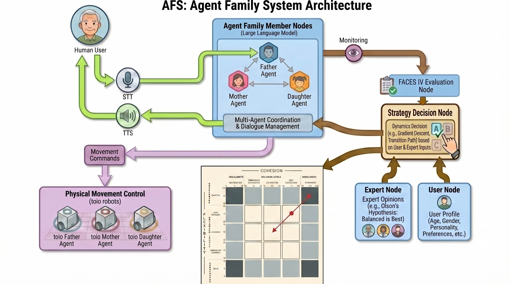
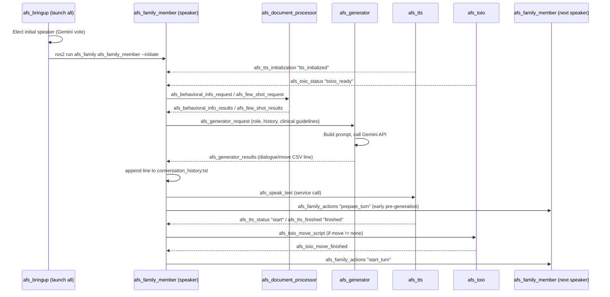
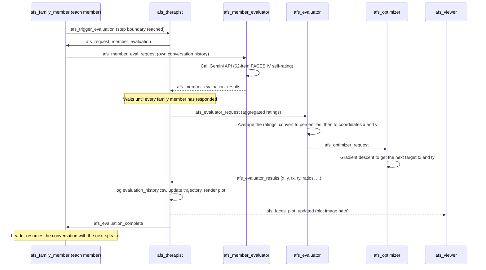
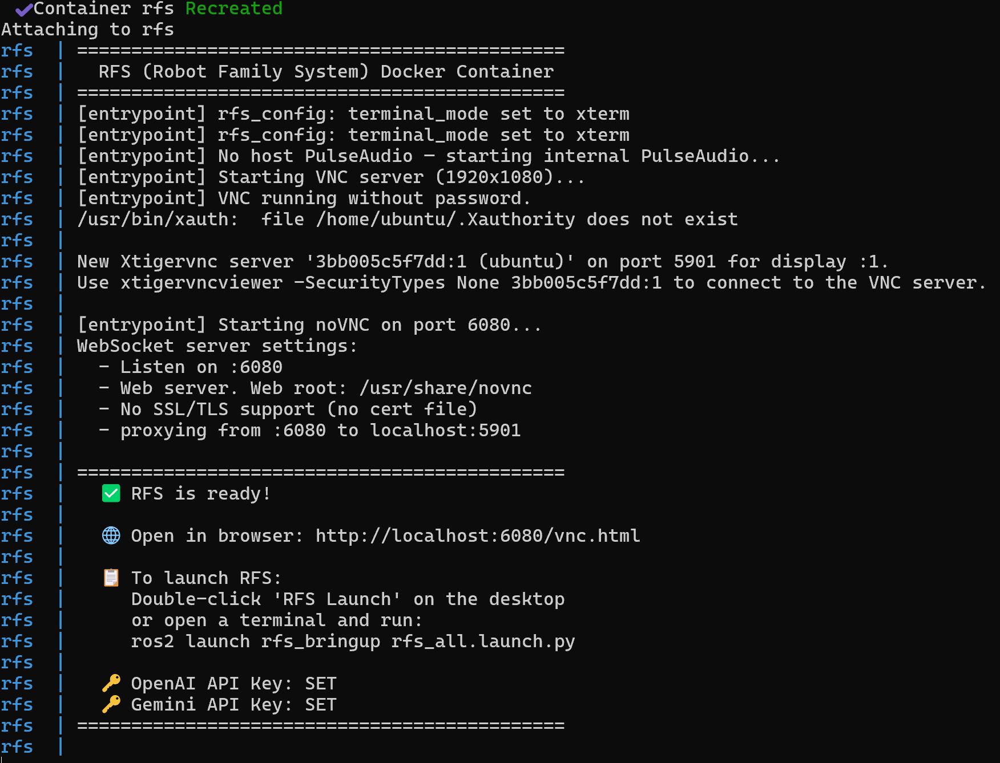
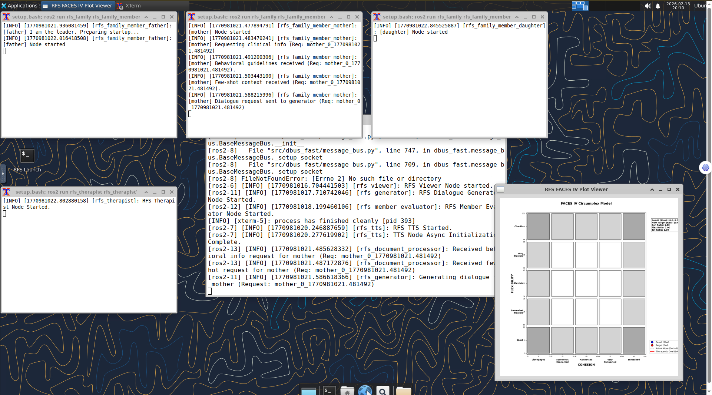

[**English**](README.md) | [**日本語**](README.ja.md)

# AFS: Agent Family System

AFS (Agent Family System) is an agent family system that aims to realize a "new family" composed of a person and robots (agents) such as father robots, mother robots, and daughter robots. By interacting with a robot family, a person feels a sense of warmth and a secure base, aiming to eventually reduce feelings of isolation and loneliness. It implements a multi-agent system that performs family-like conversations and behaviors using ROS2 and LLM. The user can intervene at any time by speaking into a microphone during the robot family's conversation. In order to make the robot family's conversation more like that of a human family, AFS adjusts the behavior of the robot family based on Olson's Circumplex Model and its evaluation scale, FACES IV. Specifically, it visualizes the current state of the robot family by plotting it on Olson's Circumplex Model, and in the case of unbalanced types, uses Gradient Descent to approach an ideal balanced type of family. These adjustments are performed by a therapist node (agent) separate from the robot family members.

This project is developed as part of the research at the **Fumihide Tanaka Laboratory** at the University of Tsukuba. Our lab mainly focuses on HRI (Human-Robot Interaction), conducting research to create intelligent agent technologies that are always by our side and help us in our lives.

🔗 **Learn more about our research**: [Fumihide Tanaka Laboratory - Projects](https://www.ftl.iit.tsukuba.ac.jp/projects/)

## 🌟 Key Features

- **Multi-Agent Interaction**: Expresses the individuality of each family member (father, mother, daughter, etc.) using LLM. Also, synchronizes each agent's conversation using ROS2 to achieve family-like conversation.
- **FACES IV Visualization**: Real-time plotting of the current and ideal states of the robot family on the axes of "Cohesion" and "Flexibility" of Olson's Circumplex Model.
- **Physical Representation via Movement**: Integration with [toio™](https://toio.io/) robots allows robots to change the physical distance from a person by moving.
- **Interactive**: Real-time Speech-to-Text (STT) and Text-to-Speech (TTS) using Gemini Live allow the user to intervene in the robot family's conversation.

## 🏗 System Architecture & Processing Flow

AFS operates in a closed-loop cycle where the **Therapist Node** (`afs_therapist`) leads the robot family members toward a balanced type according to Olson's Circumplex Model. **The Person (User)** can intervene in the robot family's conversation at any time to influence it.



### Detailed Node Responsibilities

| Node | Responsibility | Key Function |
| :--- | :--- | :--- |
| **`afs_family`** | Robot Family Node | Simulates robot family personalities (Father, Mother, Daughter, etc.) using LLM. |
| **`afs_tts`** | Text-to-Speech Node | Performs speech synthesis using Gemini Live for robot family members. |
| **`afs_toio`** | Toio Robot Node| Assigns robot family members to each [toio™](https://toio.io/) robot to enable physical movement. |
| **`afs_therapist`** | Therapist Node | Guides the robot family toward the balanced type using Gradient Descent. |
| **`afs_viewer`** | Circumplex Model Visualization Node | Plots the state (trajectory) of the robot family on the Circumplex Model. |
| **`afs_evaluation`** | FACES IV Evaluation Node | Evaluates FACES IV based on the robot family's conversation logs. |
| **`afs_stt`** | Speech-to-Text Node | Performs real-time speech recognition for human intervention using Gemini Live. |

### Sequence Diagrams

The following diagrams show the ROS2 topic/service traffic between nodes for the three main flows: startup + one conversation turn, the periodic FACES IV evaluation cycle, and a user's spoken intervention.

#### 1. Startup & Conversation Turn



#### 2. Periodic FACES IV Evaluation Cycle

Every `turns_per_step` conversation turns, the Therapist node pauses the conversation and orchestrates a full evaluation → gradient-descent → re-plot cycle before letting the family resume.



#### 3. User Voice Intervention

```mermaid
sequenceDiagram
    participant User
    participant STT as afs_stt
    participant Members as afs_family_member (all)
    participant TTS as afs_tts
    
    User->>STT: speaks into microphone (VAD detects speech)
    STT-->>Members: afs_user_intervention 'user_speech_started'
    Members->>TTS: afs_interrupt_tts 'stop_all'
    STT->>STT: transcribe recorded audio via Gemini API
    STT-->>Members: afs_user_intervention 'user_speech_transcribed:&lt;text&gt;'
    Members->>Members: each member casts a vote (Gemini API) for who should respond
    Members-->>STT: afs_responder_vote
    STT->>STT: tally votes (majority, ties broken by family_config order)
    STT-->>Members: afs_user_intervention 'user_decision:&lt;responder&gt;'
    Note over Members: only the selected member responds, the rest stay paused
    Members->>Members: afs_intervention_resolved (unlock, resume normal turns)
```

## 🚀 Getting Started

### 🖥 Native Install (Ubuntu 24.04 only) (Recommended)

If you prefer to run AFS directly on Ubuntu without Docker:

#### Prerequisites
- **OS**: Ubuntu 24.04 (Noble Numbat)
- **ROS2**: [Jazzy Jalisco](https://docs.ros.org/en/jazzy/Installation.html) (See [ROS2 Installation Guide](docs/ros2_installation.md) for step-by-step installation)
- **Hardware**: [toio™](https://toio.io/) Core Cubes (Optional), [Bluetooth Speaker](https://www.amazon.co.jp/ELUT-%E3%83%8F%E3%83%B3%E3%82%BA%E3%83%95%E3%83%AA%E3%83%BC%E3%83%BB%E3%82%B9%E3%83%9E%E3%83%BC%E3%83%88%E3%82%A2%E3%82%B7%E3%82%B9%E3%83%88%E3%82%B9%E3%83%94%E3%83%BC%E3%82%AB%E3%83%BC-%E3%83%96%E3%83%A9%E3%83%83%E3%82%AF-EMBS-HFSASBK-%EF%BC%BBBluetooth%E5%AF%BE%E5%BF%9C%EF%BC%BD/dp/B08CDQCWV8) (Optional).

#### Requirements

**1. System Dependencies**
```bash
sudo apt update && sudo apt install -y python3-tk libportaudio2
```

**2. Python Libraries**
```bash
pip install openai google-genai numpy sounddevice webrtcvad matplotlib toio-py Pillow
```

#### Installation

1. **Clone & Build**:
   ```bash
   cd ~
   git clone https://github.com/robotaichi/rfs.git afs
   cd afs
   colcon build
   source install/setup.bash
   ```

2. **🚀 Launch AFS (Core Command)**:
   Once the API keys are configured (see the **Configuration** section below), launch the entire system using the following main command:
   ```bash
   ros2 launch afs_bringup afs_all.launch.py
   ```

---

<details>
<summary><strong>🐳 Docker Quick Start (Not Recommended / Deprecated)</strong></summary>

**The easiest way to try AFS.** No Ubuntu or ROS2 installation required — works on **Windows, Mac, and Linux** via your browser.

> [!WARNING]
> **Audio I/O Limitation**: In the Docker environment, microphone (STT) and speaker (TTS) functions only work fully on Linux hosts. On Windows / Mac, audio device passthrough is not supported, so audio features will not be available. Core features such as text-based LLM interaction and FACES IV visualization work on all platforms.

**1. Install Docker**

| Platform | Installation |
| :--- | :--- |
| **Ubuntu** | `sudo apt update && sudo apt install -y docker.io docker-compose-v2` then `sudo usermod -aG docker $USER` (log out & back in) |
| **Mac** | Download and install [Docker Desktop for Mac](https://www.docker.com/products/docker-desktop/) |
| **Windows** | Download and install [Docker Desktop for Windows](https://www.docker.com/products/docker-desktop/) (WSL2 backend required) |

**2. Setup**
```bash
git clone https://github.com/robotaichi/rfs.git afs
cd afs

# Set API keys
cp docker/.env.example .env
nano .env  # Enter OPENAI_API_KEY and GEMINI_API_KEY
```

> [!TIP]
> In the `.env` file, enter the key directly after `=` without quotes:
> ```
> OPENAI_API_KEY=sk-xxxxxxxx
> GEMINI_API_KEY=AIzaxxxxxxxx
> ```

```bash
# Build & start (first build takes ~10 min)
docker compose up --build
```



**3. Access from Browser**

Open **http://localhost:6080/vnc.html** in your browser, click **"Connect"**, and you'll see the XFCE desktop environment.



**4. Enable Audio (Windows/Mac only)**

Open **http://localhost:6083** in a separate browser tab and click **"🔊 Connect Audio"**. Keep this tab open while using AFS — it bridges audio between the Docker container and your browser for TTS and STT.

> [!NOTE]
> On Linux, you can use native audio passthrough instead:
> ```bash
> docker compose -f docker-compose.yml -f docker-compose.linux.yml up --build
> ```

**5. Launch AFS**
- Double-click the **"AFS Launch"** icon on the desktop
- Or open a terminal and run:
  ```bash
  ros2 launch afs_bringup afs_all.launch.py
  ```

**6. Stop**
```bash
docker compose down
```

### 🔄 How to Update
To apply the latest updates from the repository to your Docker environment, run:
```bash
git pull origin main
docker compose build
docker compose up
```

**📌 Common Commands**

| Action | Command |
| :--- | :--- |
| Start (foreground) | `docker compose up` |
| Start (background) | `docker compose up -d` |
| View logs | `docker logs afs` |
| Stop | `docker compose down` |
| Update & Rebuild | `git pull origin main && docker compose build` |
| Rebuild after code changes | `docker compose up --build` |
| Enter container shell | `docker exec -it afs bash` |

| Setting | Details |
| :--- | :--- |
| **Browser Access** | `http://localhost:6080/vnc.html` |
| **Change Resolution** | Modify `VNC_RESOLUTION` in `.env` (Default: `1920x1080`) |
| **Set VNC Password** | Set `VNC_PASSWORD` in `.env` |
| **Session Data** | Auto-saved to Docker Volume `afs-session-data` |

**🔧 Troubleshooting**

| Issue | Cause | Solution |
| :--- | :--- | :--- |
| `exec entrypoint.sh: no such file or directory` | Windows converts line endings to CRLF | Delete the folder, re-clone with `git clone`, and rebuild. The `.gitattributes` in the repo now forces LF. |
| `failed to connect to the docker API...` | Docker Desktop is not running | Start **Docker Desktop** on your host machine. |
| API keys not set / need to update `.env` | `.env` was empty or incorrect during first run | No rebuild needed. Run `docker compose down`, edit `.env`, then `docker compose up`. |
| Container keeps restarting | Previous error left a bad state | Run `docker compose down` then `docker compose up --build` to force a clean rebuild. |

</details>

### Bluetooth Speaker & Toio Mapping (Optional)

If you plan to place speakers on top of [toio™](https://toio.io/) robots for physical movement, you must correctly map each toio™ cube to its corresponding Bluetooth speaker. This system is designed for small Bluetooth speakers like the [ELUT EMBS-HFSASBK](https://www.amazon.co.jp/ELUT-%E3%83%8F%E3%83%B3%E3%82%BA%E3%83%95%E3%83%AA%E3%83%BC%E3%83%BB%E3%82%B9%E3%83%9E%E3%83%BC%E3%83%88%E3%82%A2%E3%82%B7%E3%82%B9%E3%83%88%E3%82%B9%E3%83%94%E3%83%BC%E3%82%AB%E3%83%BC-%E3%83%96%E3%83%A9%E3%83%83%E3%82%AF-EMBS-HFSASBK-%EF%BC%BBBluetooth%E5%AF%BE%E5%BF%9C%EF%BC%BD/dp/B08CDQCWV8).

1.  **Power on Toios**: Turn on all toio™ cubes (long press the power button on the back).
2.  **Speaker Pairing**: Pair all Bluetooth speakers you intend to use with your Ubuntu PC and ensure they are "Connected".
3.  **Run Mapping Script**: 
    ```bash
    cd ~/afs
    python3 src/afs_toio/afs_toio/toio_speaker_match.py
    ```
3.  **Role Assignment (Sequential)**: When you run the script, one of the speakers will announce "Speaker [Role Name]. Please place this speaker on the rotating Toio." Immediately after the announcement, the corresponding toio™ cube will rotate; place that specific speaker onto the moving toio™. As the next speaker plays its audio, repeat this process for each remaining speaker.
4.  **Save Configuration**: Once all pairs are confirmed, the IDs will be automatically saved to `config.json`.

### Configuration

Before starting AFS, you need to set a valid API key to use the LLM. To persist the settings, add them to your `~/.bashrc`:

```bash
# 1. Open .bashrc
nano ~/.bashrc

# 2. Add these lines at the end of the file
export OPENAI_API_KEY="sk-..."
export GEMINI_API_KEY="AIza..."

# 3. Save and reload
source ~/.bashrc
```

- [**`OPENAI_API_KEY`**](https://platform.openai.com/api-keys): Essential for LLM-based dialogue generation and psychological mapping.
- [**`GEMINI_API_KEY`**](https://aistudio.google.com/app/apikey): Required for Gemini Live-based audio transcription (STT) and low-latency speech generation (TTS).

2. **Launch AFS (Launch all necessary nodes at once)**:
   ```bash
   ros2 launch afs_bringup afs_all.launch.py
   ```

## ⚙️ Settings

### `config.json` Specification
Located in `src/afs_config/config/config.json`.

| Parameter | Type | Default | Description |
| :--- | :--- | :--- | :--- |
| **`language`** | String | `"en"` | Language of interaction: `"en"` (English) or `"ja"` (Japanese). |
| **`theme`** | String | N/A | Topic of the robot family conversation. |
| **`chat_mode`** | Integer | `0` | `0` (Normal), `1` (Chat screen display). |
| **`toio_move`** | Integer | `0` | Enable toio movement: `1` (Enabled), `0` (Disabled). |
| **`target_user`** | String | `"User"` | User information interacting with the family (user name and other profiles). |
| **`family_config`** | List | `["father", "mother", "daughter"]` | Composition (roles) of the robot family. |
| **`toio_speaker_match`** | List | `[...]` | Mapping of Toio IDs and speaker IDs. |
| **`learning_rate_scaling`** | Float | `0.25` | Step width for how much to approach the balanced type. |
| **`w1`, `w2`, `w3`** | Float | `1.0, 1.0, 0.5` | Weights for each of Cohesion, Flexibility, and Communication. |
| **`turns_per_step`** | Integer | `10` | Number of conversation turns at which the therapist node evaluates (Unit: **Turns**). |
| **`vad_aggressiveness`** | Integer | `3` | Sensitivity of VAD (Voice Activity Detection) to judge the start of user speech (Range: 0-3). |
| **`silence_duration_s`** | Float | `2.0` | Silence duration to judge the end of user speech (Unit: **Seconds**). |
| **`speech_trigger_frames`** | Integer | `5` | Frames required to trigger recording (30ms/frame). |
| **`vad_debug`** | Boolean | `false` | Enable/disable VAD logs. |
| **`vad_energy_threshold`** | Float | `2000.0` | Minimum RMS energy level for speech detection. |
| **`llm_model`** | String | `"gpt-5.2-chat-latest"` | LLM model used for robot family conversation generation. |
| **`llm_temperature`** | Float | `1.0` | Temperature that controls the balance between randomness and robustness of the LLM. |
| **`llm_evaluation_model`** | String | `"gpt-5.2-chat-latest"` | LLM model used for FACES IV evaluation. |
| **`llm_evaluation_temperature`** | Float | `0.7` | Stability factor for FACES IV evaluation. |
| **`initial_coords`** | Object | `{"x": 8, "y": 8}` | Coordinates of the initial point representing the family's initial state (Scale: **0-100 Percentile**). |
| **`experiment`** | String | `""` | Label for collectively changing Theme and family composition according to the experiment. |
| **`terminal_mode`** | String | `"gnome-terminal"` | Terminal used for launching nodes. |
| **`shutdown_timer_minutes`** | Integer | `0` | Auto-shutdown timer. `0` (Executes permanently without auto-shutdown), `1+` (Specifies minutes until shutdown). |

### LLM Selection
- **Default Model (`gpt-5.2-chat-latest`)**: We use `gpt-5.2-chat-latest` as the standard for its balance of generation speed and accuracy. Change the LLM model in `config.json` as needed.
- **Temperature Settings**:
  - **Dialogue (`1.0`)**: A default setting of 1.0 is used for turn-taking to ensure natural, varied, and creative conversation that reflects the dynamic nature of robot family interactions. Adjust in `config.json` if necessary.
  - **Evaluation (`0.7`)**: A slightly lower 0.7 is used for psychological assessment to ensure reliable and consistent scoring while still capturing the subjective feel of the robot family members. Adjust in `config.json` if necessary.

## 📊 FACES IV & Gradient Descent

The **Therapist Node** evaluates the current state of the robot family using **FACES (Family Adaptability & Cohesion Evaluation Scales) IV**. If the robot family state is judged to be an unbalanced type, it uses **Gradient Descent** to calculate the optimal parameters to approach the balanced type, and provides feedback to the robot family members such as "Your family is in this state now, so please behave like this from the next conversation." Specifically, it calculates and plots target points so that the point on the Circumplex Model consisting of Cohesion and Flexibility approaches the center (50, 50), and gives instructions to the robot family members to carry out the next conversation based on this target point.

### Interactive Simulation

You can visually confirm how the Therapist Node steers the family state towards the Balanced Center with a simple interactive simulation.

👉 **[Launch Interactive Simulation](https://robotaichi.github.io/rfs/simulation/index.html)**

### Olson's Family Circumplex Model

The **Circumplex Model of Marital and Family Systems** (developed by David H. Olson) provides a framework for understanding family dynamics across three major dimensions: **Cohesion**, **Flexibility**, and **Communication**.

1.  **Cohesion**: The emotional bonding that couple and family members have toward one another.
2.  **Flexibility**: The amount of change in its leadership, role relationships, and relationship rules in response to situational and developmental stress.
3.  **Communication**: The third dimension in the Circumplex Model and is considered a facilitating dimension, which means that good communication helps couples and families alter their levels of cohesion and flexibility to better deal with developmental or situational demands.
    **※It is not drawn on Olson's Circumplex Model.**

The model classifies family states into **Balanced** (Healthy/Functional) and **Unbalanced** (Extreme/Dysfunctional) regions. Our Therapist Node uses this model to steer the unbalanced robot family back towards the balanced type.


### Percentile Conversion

Before any mathematical calculation or plotting on the Circumplex Model, the system converts the **Raw Scores** obtained from FACES IV assessments into **Percentile Scores**. This conversion is essential for plotting on the Circumplex Model and ensures normalized scale ($0$ to $100$).

<details>
<summary><strong>📊 Conversion Charts (click to expand)</strong></summary>

The following conversion charts, based on standard FACES IV norms, are used by the system.

#### 1. Balanced & Unbalanced Scales

| Raw Score | Balanced Percentile (Cohesion/Flexibility) | Unbalanced Percentile (Disengaged/Enmeshed/Rigid/Chaotic) |
| :--- | :--- | :--- |
| **7** | 16 | 10 |
| **8** | 18 | 12 |
| **9** | 20 | 13 |
| **10** | 22 | 14 |
| **11** | 24 | 15 |
| **12** | 25 | 16 |
| **13** | 26 | 18 |
| **14** | 27 | 20 |
| **15** | 28 | 24 |
| **16** | 30 | 26 |
| **17** | 32 | 30 |
| **18** | 35 | 32 |
| **19** | 36 | 34 |
| **20** | 38 | 36 |
| **21** | 40 | 40 |
| **22** | 45 | 45 |
| **23** | 50 | 50 |
| **24** | 55 | 55 |
| **25** | 58 | 60 |
| **26** | 60 | 64 |
| **27** | 62 | 68 |
| **28** | 65 | 70 |
| **29** | 68 | 75 |
| **30** | 70 | 80 |
| **31** | 75 | 85 |
| **32** | 80 | 90 |
| **33** | 82 | 95 |
| **34** | 84 | 98 |
| **35** | 85 | 99 |

#### 2. Family Communication

| Raw Score | Percentile |
| :--- | :--- |
| **10-23** | 10 |
| **24** | 12 |
| **25** | 13 |
| **26** | 14 |
| **27** | 15 |
| **28** | 18 |
| **29** | 21 |
| **30** | 24 |
| **31** | 28 |
| **32** | 32 |
| **33** | 36 |
| **34** | 40 |
| **35** | 44 |
| **36** | 50 |
| **37** | 58 |
| **38** | 62 |
| **39** | 65 |
| **40** | 70 |
| **41** | 74 |
| **42** | 80 |
| **43** | 83 |
| **44** | 86 |
| **45** | 88 |
| **46** | 90 |
| **47** | 94 |
| **48** | 96 |
| **49** | 97 |
| **50** | 99 |

</details>

### Ratio Scores

The system also calculates **Ratio Scores** to assess the family state simply. A Ratio Score greater than 1 typically indicates a healthy, balanced system, while a score less than 1 suggests an unbalanced (unhealthy) system.

These are calculated using the converted **Percentile Scores** from the charts above:

1. **Cohesion Ratio**
> [!NOTE]
> ```math
> \text{Cohesion Ratio} = \frac{C_{bal}}{(C_{dis} + C_{enm}) / 2}
> ```

2. **Flexibility Ratio**
> [!NOTE]
> ```math
> \text{Flexibility Ratio} = \frac{F_{bal}}{(F_{rig} + F_{cha}) / 2}
> ```

3. **Total Ratio**
> [!NOTE]
> ```math
> \text{Total Ratio} = \frac{\text{Cohesion Ratio} + \text{Flexibility Ratio}}{2}
> ```

### Dimension Scores

These scores are used to plot the point $(Cohesion, Flexibility)$ on the Olson Circumplex Model. They are calculated by substituting the **Percentile Scores** from the charts above into the following formulas.

1. **Cohesion Dimension Score ($x$)**
> [!NOTE]
> ```math
> x = C_{bal} + \frac{C_{enm} - C_{dis}}{2}
> ```

2. **Flexibility Dimension Score ($y$)**
> [!NOTE]
> ```math
> y = F_{bal} + \frac{F_{cha} - F_{rig}}{2}
> ```

The Dimension Scores are constrained to the following range to ensure consistent plotting:

> [!NOTE]
> ```math
> \text{Dimension Score} = \begin{cases} 5 & (\text{Score} < 5) \\ \text{Score} & (5 \le \text{Score} \le 95) \\ 95 & (\text{Score} > 95) \end{cases}
> ```

### Gradient Descent

The **Therapist Node** calculates target points by performing Gradient Descent on the robot family state vector, providing a guide for the robot family to approach the balanced type.

#### 1. State Vector ($s_t$)
The family state at turn $t$ is represented as a 7-dimensional vector consisting of the converted **Percentile Scores**:

> [!NOTE]
> ```math
> s_t = \begin{bmatrix} C_{bal} \\ C_{dis} \\ C_{enm} \\ F_{bal} \\ F_{rig} \\ F_{cha} \\ Comm \end{bmatrix} = [C_{bal}, \dots, Comm]^T
> ```

#### 2. Cost Function ($J(s_t)$)
The goal is to minimize the cost function:

> [!NOTE]
> ```math
> J(s_t) = \omega_1 \frac{U}{2B} - \omega_2 Comm_t + \frac{\omega_3}{2} \left[ (x - 50)^2 + (y - 50)^2 \right]
> ```
Where:
- $B = C_{bal} + F_{bal}$ (Balanced Sum)
- $U = C_{dis} + C_{enm} + F_{rig} + F_{cha}$ (Unbalanced Sum)
- $x, y$: Dimension Scores (see above)

#### 3. Gradient Calculation ($\nabla J(s_t)$)
The gradient vector $\nabla J(s_t)$ represents the direction of steepest increase for the cost function:

> [!NOTE]
> ```math
> \nabla J(s_t) = \left[ \frac{\partial J}{\partial C_{bal}}, \dots, \frac{\partial J}{\partial Comm} \right]^T
> ```

Individual partial derivatives are calculated as follows:

> [!NOTE]
> ```math
> \begin{aligned}
> \frac{\partial J}{\partial C_{bal}} &= - \frac{\omega_1 U}{2B^2} + \omega_3(x - 50) \\
> \frac{\partial J}{\partial F_{bal}} &= - \frac{\omega_1 U}{2B^2} + \omega_3(y - 50) \\
> \frac{\partial J}{\partial C_{enm}} &= \frac{\omega_1}{2B} + \frac{\omega_3}{2}(x - 50) \\
> \frac{\partial J}{\partial C_{dis}} &= \frac{\omega_1}{2B} - \frac{\omega_3}{2}(x - 50) \\
> \frac{\partial J}{\partial F_{cha}} &= \frac{\omega_1}{2B} + \frac{\omega_3}{2}(y - 50) \\
> \frac{\partial J}{\partial F_{rig}} &= \frac{\omega_1}{2B} - \frac{\omega_3}{2}(y - 50) \\
> \frac{\partial J}{\partial Comm} &= - \omega_2
> \end{aligned}
> ```

#### 4. Family State Update & Learning Rate
The goal state is updated iteratively:

> [!NOTE]
> ```math
> s_{t+1} = s_t - \eta(Comm_t) \cdot \nabla J(s_t)
> ```

Where the learning rate $\eta (Comm_t)$ represents the **step width**:

> [!NOTE]
> ```math
> \eta(Comm_t) = \frac{Comm_t}{100} \cdot 0.25
> ```

**0.25** is the degree to which the family type approaches the balanced type (configurable via `learning_rate_scaling` in `config.json`).

*This step width (how much to move the point) corresponds to Communication functioning as a **lubricant** to facilitate the movement of Cohesion and Flexibility.*

The resulting vector adjusts the behavior (conversation content, etc.) for individual family members, guiding the system towards the **Balanced Center (50, 50)**.

## 📚 References
- **Olson's Circumplex Model**: [Circumplex Model: An Update (Prepare/Enrich)](https://www.prepare-enrich.com/wp-content/uploads/2022/08/Circumplex-Model-An-Update.pdf)
- **FACES IV Manual**: [FACES IV: Manual de Aplicación de Instrumento](https://www.studocu.com/cl/document/universidad-de-valparaiso/trabajo-social-de-familia/faces-iv-manual-aplicacion-de-instrumento/107365427)

## 🛠 FACES-IV Validation Web App

A specialized web application for external researchers to validate the LLM-generated FACES-IV evaluations against human expert knowledge.

### Features
- **Archive Viewer**: Browse past experimental sessions stored in `src/afs_database/archive/`.
- **Conversation Context**: View the full conversation history alongside the questionnaire.
- **Evaluation Form**: Fill out the FACES-IV questionnaire (62 items) as a human expert.
- **Comparison**: Compare human scores with the robot's self-evaluations.
- **Export**: Save results as CSV for further analysis.

### Usage

**Option 1: Using ROS2 Run (Recommended)**
```bash
ros2 run afs_evaluator_app afs_evaluator_app
```

**Option 2: Direct Python Execution**
```bash
python3 src/afs_evaluator_app/afs_evaluator_app/app.py
```

Once launched, open **http://localhost:5001** in your browser.

## 💾 Data Persistence & Archival
Upon terminating the simulation (`Ctrl+C`), AFS automatically archives session logs (conversation history, evaluations, and trajectories) under `src/afs_database/archive/`.

## 📜 License
This project is licensed under the MIT License.

## 👤 Administrator

### [Taichi Hirano](https://github.com/robotaichi)
A 3rd-year PhD student in the Intelligent and Functional Systems Program at the Graduate School of Science and Technology, University of Tsukuba. He is a member of the [Fumihide Tanaka Laboratory](https://www.ftl.iit.tsukuba.ac.jp/), which focuses on HRI (Human-Robot Interaction). His research involves developing robot families (father, mother, and daughter) to reduce loneliness among elderly people living alone. He is a recipient of JST SPRING. He is also engaged in projects promoting University DX (Digital Transformation).

## 🙏 Acknowledgments
This project was supported by JST SPRING Grant Number JPMJSP2124, JSPS KAKENHI Grant Number 23H00484, and Cross-Pacific AI Initiative (X-PAI).
