# 🏗 AFS (Agent Family System) アーキテクチャ構成と処理フロー (C4モデル C2レベル)

このドキュメントでは、`ros2 launch afs_bringup afs_all.launch.py` を実行したあとに各ノードがどのように連携して動き、対話ループや心理評価（FACES IV）が行われるかを、C4モデルのコンテナレベル（C2）のアーキテクチャ図と詳細な処理フローで説明します。

---

## 1. コンテナ図 (Mermaid C2 Architecture Diagram)

```mermaid
graph TD
  %% Style definitions
  classDef person fill:#08427B,stroke:#052E56,color:#fff,stroke-width:2px;
  classDef container fill:#1168BD,stroke:#0B4E8F,color:#fff,stroke-width:2px;
  classDef extSystem fill:#999999,stroke:#666666,color:#fff,stroke-width:2px;
  classDef db fill:#f5f5f5,stroke:#333,color:#333,stroke-width:2px;

  %% Nodes
  Researcher["研究者 / ユーザ"]:::person
  
  subgraph AFS ["AFS (Agent Family System) - ROS2 Workspace"]
    Launch["afs_all.launch.py<br/>(Launch & Archival Manager)"]:::container
    
    subgraph FamilyGroup ["Family Nodes"]
      FamilyMember["afs_family_member<br/>(Father / Mother / Daughter)"]:::container
      AFSGenerator["afs_generator<br/>(Prompt Builder & Dialogue Orchestrator)"]:::container
      DocProcessor["afs_document_processor<br/>(Clinical Guidelines Provider)"]:::container
    end

    subgraph TherapistGroup ["Therapist & Evaluation Nodes"]
      Therapist["afs_therapist<br/>(Therapy Coordinator & Plotter)"]:::container
      MemberEvaluator["afs_member_evaluator<br/>(Subjective FACES IV Evaluator)"]:::container
      Evaluator["afs_evaluator<br/>(FACES IV Scorer)"]:::container
      Optimizer["afs_optimizer<br/>(Gradient Descent Planner)"]:::container
    end

    subgraph HardwareGroup ["IO & Hardware Control"]
      TTS["afs_tts<br/>(Audio Playback & Synthesis Client)"]:::container
      STT["afs_stt<br/>(Speech Recognition Client)"]:::container
      ToioNode["afs_toio<br/>(toio™ Controller)"]:::container
      Viewer["afs_viewer<br/>(Circumplex GUI Viewer)"]:::container
    end

    subgraph Database ["AFS Database / Filesystem"]
      Config["config.json"]:::db
      History["conversation_history.txt"]:::db
      Trajectory["evaluation_trajectory.json"]:::db
      Archive[("archive/ フォルダ")]:::db
    end
  end

  %% External APIs
  OpenAI["OpenAI API<br/>(GPT-4o / LLM)"]:::extSystem
  Gemini["Gemini Live API<br/>(TTS & STT)"]:::extSystem
  ToioCubes["toio™ Core Cubes<br/>(Physical Devices)"]:::extSystem
  AudioDev["オーディオデバイス<br/>(マイク / スピーカー)"]:::extSystem

  %% Relationships
  Researcher -->|"起動コマンド実行"| Launch
  Researcher -->|"音声対話 / 介入"| AudioDev
  Researcher -->|"可視化の閲覧"| Viewer

  %% Launch flow
  Launch -->|"① 起動時クリーンアップ & アーカイブ"| Archive
  Launch -->|"② 設定読み込み"| Config
  Launch -->|"③ 初期発話者決定"| OpenAI
  Launch -->|"④ 各ノードの起動"| FamilyMember
  Launch -->|"④ 各ノードの起動"| Therapist
  Launch -->|"④ 各ノードの起動"| STT
  Launch -->|"④ 各ノードの起動"| TTS
  Launch -->|"④ 各ノードの起動"| ToioNode

  %% Dialogue loop flow
  FamilyMember -->|"対話リクエスト"| AFSGenerator
  AFSGenerator -->|"プロンプト・CSV生成"| OpenAI
  FamilyMember -->|"臨床ガイドライン参照"| DocProcessor
  FamilyMember -->|"対話履歴の追記"| History
  FamilyMember -->|"発話指示"| TTS
  FamilyMember -->|"移動コマンド送信"| ToioNode

  %% Hardware interfaces
  TTS -->|"音声再生"| AudioDev
  TTS -->|"合成用リクエスト"| Gemini
  STT -->|"音声入力受け取り"| AudioDev
  STT -->|"認識用リクエスト"| Gemini
  STT -->|"ユーザ介入テキスト送信"| FamilyMember
  ToioNode -->|"BLE制御"| ToioCubes

  %% Therapist / Evaluation flow
  FamilyMember -->|"規定ターン到達時にトリガー"| Therapist
  Therapist -->|"メンバー個別評価指示"| MemberEvaluator
  MemberEvaluator -->|"主観的FACES IV採点"| OpenAI
  MemberEvaluator -->|"評価結果送信"| Therapist
  Therapist -->|"集計データ送信"| Evaluator
  Evaluator -->|"スコアリング (x, y)"| Optimizer
  Optimizer -->|"勾配降下法で目標値 (tx, ty) 算出"| Therapist
  Therapist -->|"軌跡更新"| Trajectory
  Therapist -->|"図表更新"| Viewer
  Therapist -->|"対話履歴にセラピスト分析を追記"| History
  Viewer -->|"グラフ保存"| Trajectory
```

---

## 2. 詳細な処理フロー

`ros2 launch afs_bringup afs_all.launch.py` が実行されたあとのライフサイクルは、大きく4つのフェーズに分かれています。

### フェーズ 1: 起動・初期化 (Startup & Initialization)
1. **前回のセッションデータの退避**:
   `afs_all.launch.py` は起動直後、データベースディレクトリ (`src/afs_database/`) に前回の実行時のファイル（対話ログ、評価画像、軌跡データ等）が残っている場合、それらをタイムスタンプ付きのアーカイブフォルダ (`src/afs_database/archive/YYYYMMDD_HHMMSS/`) に自動退避します。
2. **プロセスのクリーンアップ**:
   過去の起動で残ってしまった `ffplay`、`spd-say` や各 ROS2 ノードなどの孤立プロセスを自動検知して終了し、クリーンな起動環境を保証します。
3. **設定の読み込み**:
   `src/afs_config/config/config.json` をロードして、家族構成、言語設定、ターゲット、会話のテーマ等を把握します。
4. **初期発話者の決定**:
   OpenAI API (`gpt-4o`) を用いて、会話テーマから最も話し始めるのにふさわしい家族メンバー（例: お父さん役、お母さん役など）を自動決定します。
5. **ノードの同時起動**:
   ROS2 の `launch` 機構を介して、家族メンバーノード、セラピストノード、TTS、STT、Toio制御、Viewerなど全てのコンテナ（ROS2 ノード）を一斉起動します。

### フェーズ 2: 対話・動作ループ (Interaction Loop)
1. **初期発話トリガー**:
   決定された初期発話メンバーのノードが、`tts_ready` および `toios_ready` を検知した瞬間に、最初の一歩となるシナリオ生成をリクエストします。
2. **臨床ガイドラインと臨床データのロード**:
   発話対象のメンバーノードは `afs_document_processor` に対して現在の家族状態（凝集性 $x$、適応性 $y$）に基づく臨床的なガイドライン、および臨床例データ（Few-shot context）をリクエストします。
3. **対話テキスト & 動作スクリプトの生成**:
   取得したガイドラインや直近の対話履歴などをまとめたリクエストを `afs_generator` ノードへ送信します。`afs_generator` は OpenAI API を用いて、キャラクターとして発話するセリフ（発話テキスト）と、そのときに Toio が実行する移動指示（動作スクリプト）を CSV 形式で生成し、返します。
4. **音声合成と再生 (TTS)**:
   メンバーノードは生成されたセリフを `afs_tts` ノードのサービス（`afs_speak_text`）へ渡し、Gemini Live API などを用いて音声合成・実スピーカーから音声再生します。
5. **物理ロボットの移動 (toio™)**:
   実機の動作コマンド（動作スクリプト）が `afs_toio` ノードに送られ、Bluetooth Low Energy (BLE) 経由で toio™ コア キューブが動作します。
6. **先行生成 (One-Ahead Pipeline)**:
   再生が始まると、次のターンを担うメンバーへ `prepare_turn` シグナルが送信され、バックグラウンドで次のセリフが事前生成されます。音声と移動が終了した瞬間に `start_turn` が送られ、遅延なく次のターンが始まります。

### フェーズ 3: 心理評価・介入と軌跡最適化 (Evaluation & Optimization)
1. **評価のトリガー**:
   設定されたターン数（デフォルト: 10ターン）に達すると、メンバーノードは一時的に対話ループを一時停止し、`afs_therapist` に評価開始のトリガー（`afs_trigger_evaluation`）を送信します。
2. **メンバーごとの主観的評価**:
   `afs_therapist` からの要請を受け、`afs_member_evaluator` ノードが各メンバーになりきって、直近の会話内容から 62 問の **FACES IV 心理質問票** に対して 1〜5 点で自己採点（LLM で評価）します。
3. **スコア集計とマッピング**:
   `afs_evaluator` ノードは、全メンバーの回答を平均・集計し、FACES IV 換算表に基づいて家族の現在の「凝集性 $x$」「適応性 $y$」のパーセンタイル次元スコアを算出します。
4. **勾配降下法による最適化と目標算出**:
   算出された現在位置 $(x, y)$ を受け取った `afs_optimizer` ノードは、損失関数（アンバランスな極端値への接近に対するペナルティ、およびバランス状態 (50, 50) への引き込み）の勾配を算出し、家族がより健全な「バランス」タイプへ移行するための次回セッションの目標座標 $(tx, ty)$ を計算します。
5. **データの保存と可視化の更新**:
   - 履歴データは `evaluation_trajectory.json` と `evaluation_history.csv` に保存されます。
   - `afs_therapist` は新しい現在値・目標値を可視化プロット（Matplotlib グラフ）として生成し、`afs_viewer` ノード（GUI）を更新します。
   - 対話履歴の末尾には `[THERAPIST_STALL_SESSION_ANALYSIS]` というシステムタグで、臨床目標値が追記されます。
6. **対話ループの再開**:
   評価フローが完了すると `afs_evaluation_complete` シグナルが家族ノードに届き、新しい治療目標（状態座標）を考慮したキャラクターの感情プロファイルが適用された上で、対話ループが再開されます。

### フェーズ 4: 終了とデータアーカイブ (Shutdown & Archival)
1. **シミュレーション停止**:
   研究者がターミナルで `Ctrl+C` を入力すると、ROS2 システムがシャットダウンシーケンスに入ります。
2. **自動アーカイブ処理**:
   `afs_all.launch.py` 内に登録されたシャットダウンフック（`atexit` 処理）がトリガーされ、現在実行中だった最新のセッションログ（`conversation_history.txt`、`evaluation_plot.png`、`evaluation_trajectory.json` など）を自動的にタイムスタンプ付きフォルダに移動・保管します。これにより、データ消失を完全に防止します。
