# 🏗 AFS (Agent Family System) Architecture & Processing Flow (C4 Model - Container Level C2)

This document describes how the containers (ROS2 nodes, external APIs, and filesystems) interact with each other and the processing flow after executing `ros2 launch afs_bringup afs_all.launch.py`.

---

## 1. Container Diagram (Mermaid C2 Architecture Diagram)

```mermaid
graph TD
  %% Style definitions
  classDef person fill:#08427B,stroke:#052E56,color:#fff,stroke-width:2px;
  classDef container fill:#1168BD,stroke:#0B4E8F,color:#fff,stroke-width:2px;
  classDef extSystem fill:#999999,stroke:#666666,color:#fff,stroke-width:2px;
  classDef db fill:#f5f5f5,stroke:#333,color:#333,stroke-width:2px;

  %% Nodes
  Researcher["Researcher / User"]:::person
  
  subgraph AFS ["AFS (Agent Family System) - ROS2 Workspace"]
    Launch["afs_all.launch.py<br/>(Launch & Archival Manager)"]:::container
    
    subgraph FamilyGroup ["Family Nodes"]
      FamilyMember["afs_family_member<br/>(Father / Mother / Daughter)"]:::container
      AFSGenerator["afs_generator<br/>(Prompt Builder & Dialogue Orchestrator)"]:::container
      DocProcessor["afs_document_processor<br/>(Clinical Guidelines Provider)"]:::container
    end

    subgraph TherapistGroup ["Therapist & Evaluation Nodes"]
      Therapist["afs_therapist<br/>(Therapy Coordinator & Plotter)"]:::container
      MemberEvaluator["afs_member_evaluator<br/>(Subjective FACES IV Evaluator)"]:::container
      Evaluator["afs_evaluator<br/>(FACES IV Scorer)"]:::container
      Optimizer["afs_optimizer<br/>(Gradient Descent Planner)"]:::container
    end

    subgraph HardwareGroup ["IO & Hardware Control"]
      TTS["afs_tts<br/>(Audio Playback & Synthesis Client)"]:::container
      STT["afs_stt<br/>(Speech Recognition Client)"]:::container
      ToioNode["afs_toio<br/>(toio™ Controller)"]:::container
      Viewer["afs_viewer<br/>(Circumplex GUI Viewer)"]:::container
    end

    subgraph Database ["AFS Database / Filesystem"]
      Config["config.json"]:::db
      History["conversation_history.txt"]:::db
      Trajectory["evaluation_trajectory.json"]:::db
      Archive[("archive/ Folder")]:::db
    end
  end

  %% External APIs
  OpenAI["OpenAI API<br/>(GPT-4o / LLM)"]:::extSystem
  Gemini["Gemini Live API<br/>(TTS & STT)"]:::extSystem
  ToioCubes["toio™ Core Cubes<br/>(Physical Devices)"]:::extSystem
  AudioDev["Audio Device<br/>(Mic / Speaker)"]:::extSystem

  %% Relationships
  Researcher -->|"Run Launch Command"| Launch
  Researcher -->|"Voice Dialogue / Intervention"| AudioDev
  Researcher -->|"View Visualizations"| Viewer

  %% Launch flow
  Launch -->|"1. Startup Cleanup & Archive"| Archive
  Launch -->|"2. Read Config"| Config
  Launch -->|"3. Determine Initial Speaker"| OpenAI
  Launch -->|"4. Launch All Nodes"| FamilyMember
  Launch -->|"4. Launch All Nodes"| Therapist
  Launch -->|"4. Launch All Nodes"| STT
  Launch -->|"4. Launch All Nodes"| TTS
  Launch -->|"4. Launch All Nodes"| ToioNode

  %% Dialogue loop flow
  FamilyMember -->|"Dialogue Request"| AFSGenerator
  AFSGenerator -->|"Prompt & CSV Generation"| OpenAI
  FamilyMember -->|"Read Clinical Guidelines"| DocProcessor
  FamilyMember -->|"Append to Dialogue Log"| History
  FamilyMember -->|"Play Audio Request"| TTS
  FamilyMember -->|"Send Movement Script"| ToioNode

  %% Hardware interfaces
  TTS -->|"Play Speech"| AudioDev
  TTS -->|"Synthesis Request"| Gemini
  STT -->|"Record Input"| AudioDev
  STT -->|"Speech Recognition"| Gemini
  STT -->|"Send User Intervention text"| FamilyMember
  ToioNode -->|"Control BLE"| ToioCubes

  %% Therapist / Evaluation flow
  FamilyMember -->|"Trigger Evaluation at Turn Limit"| Therapist
  Therapist -->|"Request Subjective Evaluations"| MemberEvaluator
  MemberEvaluator -->|"FACES IV Subjective Scores"| OpenAI
  MemberEvaluator -->|"Send Evaluation results"| Therapist
  Therapist -->|"Send Aggregated scores"| Evaluator
  Evaluator -->|"Scoring (x, y)"| Optimizer
  Optimizer -->|"Gradient Descent targets (tx, ty)"| Therapist
  Therapist -->|"Update Trajectories"| Trajectory
  Therapist -->|"Update Plot View"| Viewer
  Therapist -->|"Append Therapist Analysis"| History
  Viewer -->|"Save Circumplex Plot"| Trajectory
```

---

## 2. Detailed Processing Flow

The lifecycle after running `ros2 launch afs_bringup afs_all.launch.py` is divided into four main phases:

### Phase 1: Startup & Initialization
1. **Previous Session Data Safekeeping**:
   `afs_all.launch.py` automatically archives any leftover files (dialogue history, evaluation plots, trajectories, etc.) in the database directory (`src/afs_database/`) to a timestamped folder (`src/afs_database/archive/YYYYMMDD_HHMMSS/`) to prevent data loss.
2. **Process Cleanup**:
   It detects and terminates any lingering processes from previous runs (e.g., `ffplay`, `spd-say`, or other ROS2 nodes) to ensure a clean starting environment.
3. **Configuration Loading**:
   It loads `src/afs_config/config/config.json` to configure family members, language settings, target user, conversation theme, etc.
4. **Initial Speaker Selection**:
   It queries the OpenAI API (`gpt-4o`) to determine which family member (e.g., father, mother, or daughter) is most suitable to initiate the conversation based on the selected theme.
5. **Parallel Node Launch**:
   Using the ROS2 launch framework, it runs all family nodes, therapist nodes, TTS/STT interfaces, toio™ controllers, and the viewer GUI.

### Phase 2: Interaction Loop
1. **Initial Statement Trigger**:
   Once `tts_ready` and `toios_ready` are satisfied, the selected initial speaker triggers the first dialogue generation.
2. **Guidelines & Reference Retrieval**:
   The active member node requests clinical guidelines and few-shot reference examples based on the family's current coordinates $(x, y)$ on the Olson Circumplex model from the `afs_document_processor` node.
3. **Dialogue & Move Generation**:
   The active member node compiles the dialogue request and sends it to `afs_generator`. The generator node queries the OpenAI API to produce the speech text and physical toio™ movement commands in a unified CSV format.
4. **Speech Playback (TTS)**:
   The speech text is sent to the `afs_tts` service (`afs_speak_text`), which synthesizes audio using the Gemini Live API and plays it through the target speaker.
5. **Physical Robot Movement (toio™)**:
   Simultaneously, the movement command is dispatched to `afs_toio` to move the corresponding physical toio™ core cube via Bluetooth Low Energy (BLE).
6. **One-Ahead Pipeline (Pre-Generation)**:
   While the current audio is playing, the speaker sends a `prepare_turn` signal to the next speaker, allowing them to pre-generate their response in the background. As soon as playback/movement finishes, `start_turn` is issued, launching the next response immediately.

### Phase 3: Evaluation & Optimization
1. **Evaluation Trigger**:
   Once the configured turn limit (default: 10 turns) is reached, the active member halts the interaction loop and sends a trigger (`afs_trigger_evaluation`) to `afs_therapist`.
2. **Subjective Member Ratings**:
   The `afs_therapist` node prompts the `afs_member_evaluator` nodes. Each node acts as a specific family member and evaluates the recent conversation history, filling out the 62-item **FACES IV Questionnaire** (returning 1-5 scores via OpenAI API).
3. **Aggregation & Percentile Scoring**:
   The `afs_evaluator` node averages these ratings and calculates the family's current Cohesion $x$ and Flexibility $y$ percentile scores using clinical FACES IV reference tables.
4. **Therapeutic Target Optimization**:
   The `afs_optimizer` node takes the current coordinates $(x, y)$ and runs a gradient descent step based on a custom loss function (penalizing extreme unbalanced states and pulling towards the central balanced zone). It calculates the target coordinates $(tx, ty)$ for the next session.
5. **Data & Visualization Updates**:
   - Trajectory data is appended to `evaluation_trajectory.json` and logged to `evaluation_history.csv`.
   - `afs_therapist` plots the updated trajectory onto a Matplotlib chart and notifies the `afs_viewer` GUI to refresh.
   - The therapist analysis is appended to the dialogue log.
6. **Loop Resumption**:
   Once the evaluation is complete, the `afs_evaluation_complete` signal is sent, the member nodes clear their wait state, apply the new target parameters to adjust their personalities, and resume the dialogue loop.

### Phase 4: Shutdown & Archival
1. **Simulation Stopping**:
   When the researcher enters `Ctrl+C` in the terminal, the ROS2 system begins a graceful shutdown.
2. **Session Archival**:
   The exit handler in `afs_all.launch.py` is invoked to move all active logs (`conversation_history.txt`, `evaluation_plot.png`, `evaluation_trajectory.json`, etc.) to the archive directory, protecting the experiment's final results.
